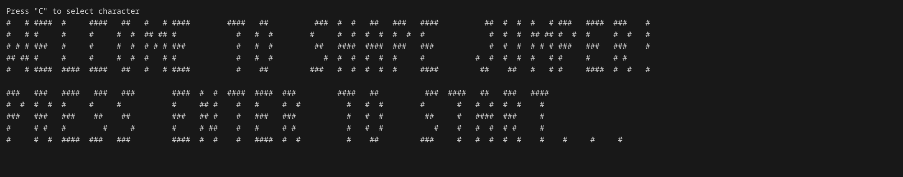
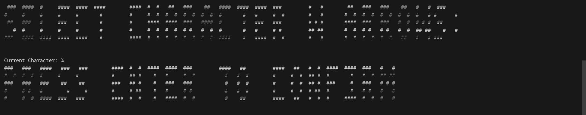
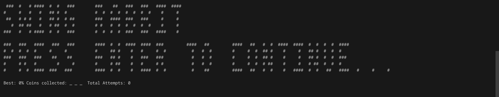
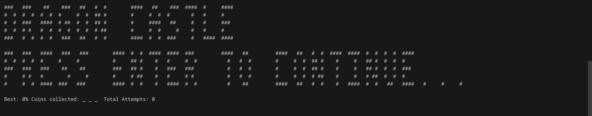
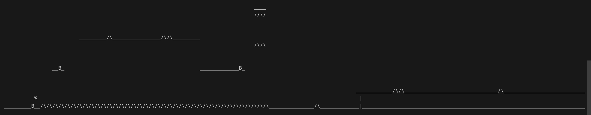
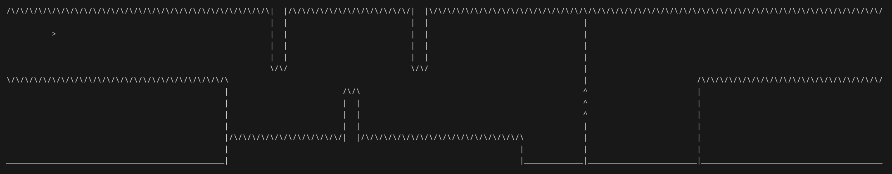
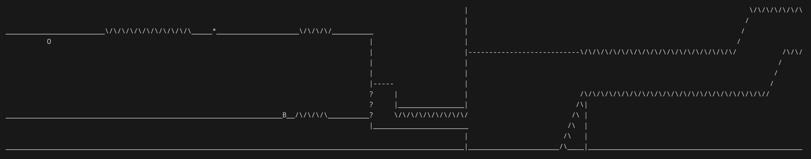

# Shape Jumper

Shape Jumper is a Linux console port of the popular game Geometry Dash by Robtop Games. The premise is the same as the original, try to beat each level in as few attempts as possible. This game uses the ncurses library for a better terminal interface and the SFML library to handle audio.

## Installation
### Install ncurses dependencies

#### Debian / Ubuntu
`sudo apt install libncurses5-dev libncursesw5-dev`

#### Fedora / CentOS / RHEL
`sudo dnf install ncurses-devel`

#### Arch Linux / Manjaro
`sudo pacman -S ncurses`

#### openSUSE
`sudo zypper install ncurses-devel`

#### Alpine Linux
`sudo apk add ncurses-dev`

### Install SFML dependencies

#### Debian / Ubuntu
`sudo apt install libsfml-dev`

#### Fedora / CentOS/ RHEL
`sudo dnf install sfml-devel`

#### Arch Linux / Manjoro
`sudo pacman -S sfml`

#### openSUSE
`sudo zypper install sfml2-devel`

#### Alpine Linux
`sudo apk add sfml-dev`

## Running the program
### Build the program first
With the included makefile use the `make` command to build the program then use the `./shapeJumper` command to run it. 
#### Usage
`--debug` enters debug mode which disables collision and unlocks all levels.
`--help` explains the game controls and UI.
`--version` returns the current version of the application. 
### If there are issues
If the program is not working use the `make clean` command to clean the program and then the `make` command to rebuild it.

# Gameplay
### Title Screen

### Character Select

### Level Select

### Cube Gameplay

### Ship Gameplay

### Ball Gameplay

## Things to note
### Game Engine
This game engine was built entirely from the ground up and my goal was to install as few libraries as possible, it is ran through the command line as I did not want to spend much time on assets, and could keep my primary focus on the engine and logic itself!
### Saving
This game automatically saves progress after each attempt and upon running the program, if a save file exists it will be loaded into the player.
### Adherence to the original
This game was simply meant to expand my c++ and game development experience so many features from the original game are missing, feel free to add them or create new levels!

## Contributing

Pull requests are welcome. For major changes, please open an issue first
to discuss what you would like to change.

## Credits

### This project would not be possible if not for the copyright free music I used. If you are a creator of a song and do not want it used please contact for removal

#### Title Screen Music: Rexlambo - Space 
is under a Creative Commons BY 3.0 license. 
https://creativecommons.org/licenses/by/3.0/
https://www.youtube.com/channel/UCqBmRmtaHbuodGuCkrVYKPA 
Music powered by BreakingCopyright: https://youtu.be/
🔎 Find more music here: https://breakingcopyright.com

#### Level 1 Music: Song: Swing Rabbit ! Swing !
Composer: Amarià
Website: https://www.youtube.com/channel/UCjpsqeJxRUqIBSl0tVSlCog
License: Creative Commons (BY 3.0) https://creativecommons.org/licenses/by/3.0/
Music powered by BreakingCopyright: https://breakingcopyright.com

#### Level 2 Music: Song: Dragon Castle
Composer: Makai Symphony
Website: https://www.youtube.com/channel/UC8cn3OdeqYhyhNUyrMxOQKQ
License: Creative Commons (BY-NC 3.0) https://creativecommons.org/licenses/by-nc/3.0/
Music powered by BreakingCopyright: https://breakingcopyright.com

#### Level 3 Music: Song: Samurai
Composer: DEAF KEV
Website: https://www.youtube.com/c/DEAFKEV
License: Creative Commons (BY-NC 3.0) https://creativecommons.org/licenses/by-nc/3.0/
Music powered by BreakingCopyright: https://breakingcopyright.com

## License

[MIT](https://choosealicense.com/licenses/mit/)